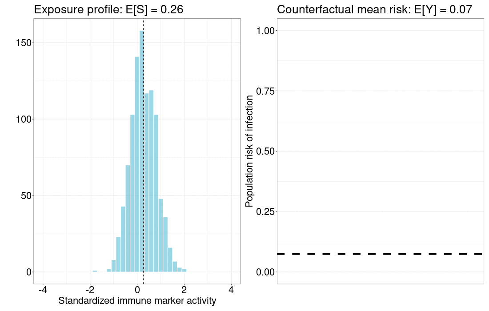

class: inverse, center, middle

.huge[Vaccine correlates]

```{r xaringan-themer, include=FALSE, warning=FALSE}
library(xaringanthemer)

extra_css <- list(
  ".inverse" = list(
    `background-image` = "url(img/virusbg.jpeg)",
    `background-size` = "cover"
    ),
  ".small" =  list(`font-size` = "80%"),
  ".tiny" =  list(`font-size` = "70%"),
  ".large" =  list(`font-size` = "150%"),
  ".huge" =  list(`font-size` = "300%"),
  "ul li" = list(`margin-bottom` = "10px"),
  ".gray" = list(color = "#C0C0C0"),
  ".red" = list(color = "#FF0000"),
  ".blue1" = list(color = "#3AABBE"),
  ".blue2" = list(color = "#2A6D90"),
  ".blue3" = list(color = "#446874"),
  ".purple" = list(color = "#624474"),
  ".mutedred" = list(color = "#745344"),
  "a" = list(color = "#3AABBE"),
  "a:hover" = list("text-decoration" = "underline")
)

style_mono_accent(
  base_color = "#446874",
  header_font_google = google_font("DM Sans"),
  text_font_google   = google_font("DM Sans", "400", "400i"),
  code_font_google   = google_font("Courier Prime"),
  extra_css = extra_css
)
```

<style type="text/css">
.remark-slide-content {
    font-size: 22px
}
</style>

---

## Correlates of risk and protection

Two, interrelated goals of vaccine correlates analyses are to

* identify/validate possible __surrogate endpoints__\*;
* understand __protective mechanisms__ of vaccines.

If an __immune correlate__ is established to __reliably predict vaccine
efficacy__, then subsequent efficacy trials may use it as the __primary
endpoint__.

__Accelerates approval__ of

* existing vaccines in __different populations__ (e.g., in children);
* __new vaccines__ within the same class.

.footnote[[*] [Prentice (1989)](https://doi.org/10.1002/sim.4780080407) ]

---

## Correlates of risk and protection

.large[__Two levels of correlates analysis__\*:]

__Correlates of risk (CoR):__

* Correlation of immune response in vaccine recipients with outcome
* Prediction of risk
* Evaluated via _associative_ parameters

__Correlates of protection (CoP)__:

* Evaluate immune response's ability to predict vaccine efficacy
* Evaluated via _causal_ parameters

.footnote[[*] [Plotkin and Gilbert (2012)](https://doi.org/10.1093/cid/cis238),
[Qin et al. (2007)](https://doi.org/10.1086/522428) ]

---

## Correlates of protection

__Effect modifiers of vaccine efficacy (VE)__

* How does VE vary across subgroups defined by immune response?
* e.g., [Juraska et al. (2020)](https://doi.org/10.1093/biostatistics/kxy074)


__Path-specific mediators of VE__

* What percentage of VE is attributable to immune response?
* [Cowling et al. (2019)](https://doi.org/10.1093/cid/ciy759)
* [Benkeser et al. (2021+)](https://arxiv.org/abs/2103.02643)

__Stochastic interventional VE__

* How would shifting the immune response distribution impact VE?
* [Hejazi et al. (2020)](https://doi.org/10.1111/biom.13375), Hejazi et al.
  (2021+)

---

## Measuring correlates

* Running assays on >30k samples is .red[expensive], __statistically
  unnecessary__.
* Use a __case-cohort design\*__ to _measure immune responses_ in
  * a stratified random subcohort (\~1600 individuals)
  * all SARS-CoV-2 infection endpoints

```{r, casecohortplot, echo = FALSE, out.width = "70%", fig.align = "center"}
knitr::include_graphics(here::here("img", "casecohort.png"))
```

.footnote[[*] [Prentice (1986)](https://www.jstor.org/stable/2336266) ]

---

## Measuring correlates

* Case-cohort designs are a special case of _two-phase sampling\*_:
  * Phase 1: measure baseline, vaccine, endpoint on everyone.
  * Phase 2: given baseline, vaccine, endpoint, select members of immune
    response subcohort with (possibly known) probability.

--

* Complete (.red[unobserved]) data $X = (L, A, S, Y) \sim P_0^X \in \mathcal{M}^X$:
  * $L$ (covariates): sex, age, baseline risk/exposure score,
  * $A$ (treatment): randomized placebo vs. vaccine assignment,
  * $S$ (exposure): candidate marker immune response profiles at Day 57,
  * $Y$ (outcome): SARS-CoV-2 infection (starting at 7 days after Day 57).
* Observed data $O = (C, C X) = (L, C, C S, Y)$, where $C \in \{0,1\}$ indicates
  inclusion in the second phase sample.

.footnote[[*] [Breslow (2003)](https://doi.org/10.1214/aos/1059655907),
[Breslow (2009)](https://doi.org/10.1007/s12561-009-9001-6) ]

---

## Statistical challenges

__Estimation in two-phase designs:__

* Individuals who contract COVID may __differ from other participants__.
* Two-phase design .blue[_over-samples_] these individuals.
* Augmented inverse weighting methods __account for differences__.

--

__CoVPN statisticians are committed to open science:__

* A version-controlled SAP is
  [available](https://doi.org/10.6084/m9.figshare.13198595) for review.
* An [open source GitHub
  repository](https://github.com/CoVPN/correlates_reporting) implements methods
  from the SAP.
  - Tools: `RMarkdown`, `renv`, `bookdown`, GNU Make, Travis-CI, AWS.
  * Proof-of-concept for validating (causal) ML in regulatory context.

???

__Low case numbers due to highly effective vaccines (e.g., 95% VE):__

* Power for CoP analyses driven by __vaccine breakthroughs__.
* CoR $>$ 25 breakthroughs; CoP $>$ 50 breakthroughs.

---

class: inverse, center, middle

.huge[Stochastic Interventional Vaccine Efficacy (SVE) `r icons::icon_style(icons::fontawesome("syringe"), fill="white")`]

---

## Exposure-Shifting Interventions



---

## Stochastic Interventions

* _Stochastic interventions\*_ as modified treatment policies:
   $$d(s, l) = s + \delta \text{(if plausible)}, s \text{(otherwise)}$$
* Our estimand is $\psi_{0, d} := \mathbb{E}_{P_0^d}\{Y_{d(S,L)}\}$,
  mean of counterfactual $Y_{d(S, L)}$.
* Construct doubly robust one-step and targeted (TML) estimators rooted in
  semiparametric efficiency theory.
* Use machine learning to flexibly estimate nuisance parameters.

.footnote[[*] [Díaz & van der Laan
  (2012)]( https://doi.org/10.1111/j.1541-0420.2011.01685.x), [Díaz & van der
  Laan (2018)](https://doi.org/10.1007/978-3-319-65304-4_14),
  [Díaz & Hejazi (2020)](https://doi.org/10.1111/rssb.12362) ]

???

* _Stochastic interventions_ modify the value $S$ would naturally assume by
  drawing from a modified exposure distribution.
* Consider post-intervention value $S^{\star} \sim G^{\star}(\cdot \mid L)$;
  static interventions are a special case (degenerate distribution).
* Such an intervention generates a counterfactual RV
  $Y_{G^{\star}} := f_Y(S^{\star}, L, U_Y)$, with distribution $P_0^{\delta}$.
* Estimate $\psi_{0,\delta} := \mathbb{E}_{P_0^{\delta}} \{Y_{G^{\star}}\}$,
  the counterfactual mean under post-intervention distribution $G^{\star}$.

---

## Quantifying SVE

* Causal parameter based on vaccine efficacy (VE) estimands:
  $$\text{SVE}(\delta) = 1 - \frac{\mathbb{E}[\mathbb{P}(Y = 1 \mid A = 1,
    S = s + \delta, L = l) \mid A = 1, L]}{\mathbb{P}(Y(0)=1)}.$$
* $\mathbb{P}(Y(0)=1)$: counterfactual infection risk in the placebo arm.
  Under randomization, $\mathbb{P}(Y(0)=1) = \mathbb{P}(Y=1 \mid A=0)$.
* Summarizes VE thru stochastic interventions indexed by $\delta$.
* _Inverse probability weighted augmentation\*_ to correct for two-phase
  sampling bias.
* Open source `R` package\* at https://github.com/nhejazi/txshift

.footnote[[*] [Rose and van der Laan
  (2011)](https://doi.org/10.2202/1557-4679.1217),
  [Hejazi et al. (2020)](https://doi.org/10.1111/biom.13375),
  [Hejazi & Benkeser (2020)](https://doi.org/10.21105/joss.02447) ]

---

## SVE in COVID: Marker 1

```{r, svecorr1, echo = FALSE, out.width = "70%", fig.align = "center"}
knitr::include_graphics(here::here("img", "sieveConcept2.png"))
```

---

## SVE in COVID: Marker 2

```{r, svecorr2, echo = FALSE, out.width = "70%", fig.align = "center"}
knitr::include_graphics(here::here("img", "sieveConcept2.png"))
```

---

## Amazing statisticians

.pull-left[.tiny[
__Leadership__
* Dean Follmann (NIAID)
* Yonghong Gao (BARDA)
* Peter Gilbert (FHCRC, UW)

__NIAID__
* Martha Nason
* Mike Fay
* Pretty much all of NIAID Biostatistics

__CoVPN__
* David Benkeser (Emory)
* Marco Carone (UW)
* Iván Díaz (Weill Cornell)
* Alex Luedtke (UW)
* ...many others!

]]

.pull-right[.tiny[
__Fred Hutch__
* Youyi Fong
* Holly Janes
* Michal Juraska
* Yunda Huang
* Ying Huang
* Ollivier Hyrien
* ...many others!

__OWS Company statisticians__
* Way too many to name!
]]
